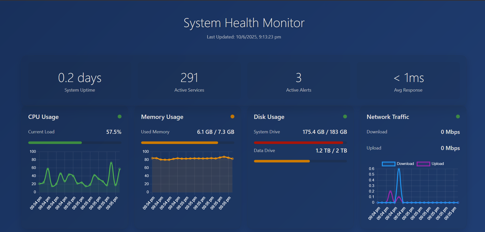
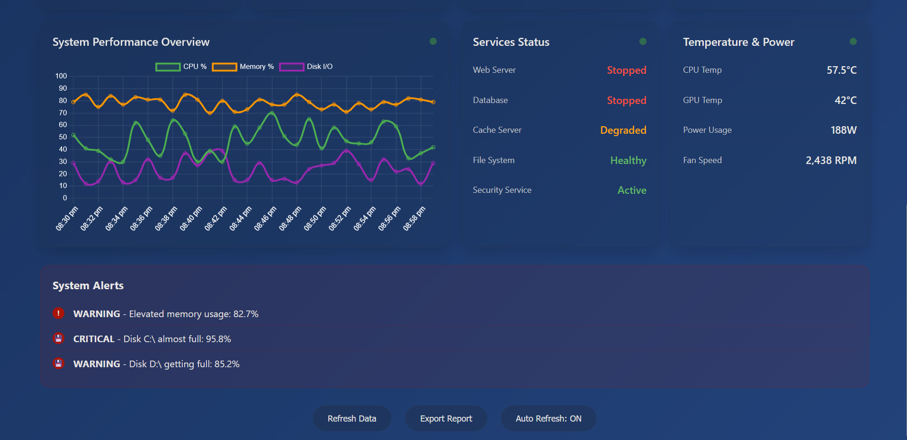

# Health Monitor System

A real-time health monitoring dashboard built with Python Flask and psutil that provides accurate system metrics and smart alerts.

---

## 🚀 Features

### Real Data For Everything
- **CPU Usage:** Real-time percentage, core count, frequency  
- **Memory Usage:** Actual RAM usage in GB and percentage  
- **Disk Usage:** Real disk space for all drives  
- **Network Speed:** Real upload/download speeds in Mbps  
- **Temperature:** CPU and system temperatures (with fallback if sensors unavailable)  
- **System Uptime:** Uptime in days  
- **Process Count:** Number of running processes  
- **Power Usage:** Estimated power consumption based on CPU usage  
- **Services Status:** Real status of system services  
- **System Alerts:** Dynamic alerts based on thresholds  

### Smart Features
- Automatic alerts when CPU > 80%, Memory > 85%, Disk > 90%  
- Historical data storage for charts (last 20 data points)  
- Real-time network speed calculation  
- Service detection for web servers, databases, and security services  

---

## 💻 Installation

1. Clone this repo:

```bash
git clone https://github.com/KAUSHAL9893/health-monitor-system.git
cd health-monitor-system
```
2. Install dependencies
```bash
pip install flask psutil
```
## ▶️ How to Run

Start the Flask app:
```bash
python app.py
```
Open your browser and go to:
```bash
http://localhost:5000
```
---
## 🔍 Testing It

   - Open Task Manager and run CPU-intensive tasks — watch CPU usage spike

   - Open multiple browser tabs — watch memory usage increase

   - Download a large file — see real network speed activity

   - Check for alerts when usage thresholds are crossed

## ⚙️ What You'll See

   - Real CPU usage and frequency

   - Actual memory and disk usage

   - Real-time network upload/download speeds

   - CPU temperature and system uptime

   - Alerts dynamically generated based on your system’s health

## 🛠 Troubleshooting

   - Some data may show simulated values if hardware sensors are unavailable.

   - Temperature readings use fallback estimations if no sensors found.

   - Power usage is estimated from CPU load.

---





